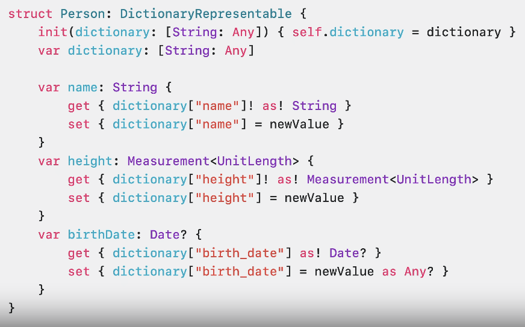

# Swift macro
[Write Swift macros](https://developer.apple.com/videos/play/wwdc2023/10166/)  
[Expand on Swift macros](https://developer.apple.com/videos/play/wwdc2023/10167/)


Swift macro는 크게는 두 가지가 있다.   
freestanding 매크로 2종류, attached 매크로 5종류가 있다.

## freestanding macro

### @freestanding(expression)
표현식을 가지고 있고 함축적으로 표현해줄 수 있는 매크로
표현식: 실행하고 결과를 생성하는 코드 단위


### @freestanding(declaration)
함수, 변수 등 타입과 같은 하나 이상의 선언을 할 수 있는 매크로


## attached

### @attached(peer)
특정 선언에 첨부되는 매크로
declaration을 검사하고 내부 이름, 타입, 기타 정보에 접근이 가능
method나 property에서 사용하면 해당 유형의 멤버가 생성  
ex) concurrency를 안쓰는곳에 concurrency 지원을 하는 경우, onCompletion 파라미터를 받고 콜백에서 await를 호출해줄 수 있다.

### @attached(accessor)
property에 get, set, willSet, didSet과 같은 접근자를 추가하는 매크로  
변수 및 서브스크립트에 붙일 수 있으며 get, set, willSet, didSet과 같은 접근자에도 붙일 수 있다.    
ex) 반복되는 프로퍼티 래퍼들을 간단하게 만들 수 있다.

### @attached(memberAttribute)
새로운 type이나 extension을 추가하는 매크로   
- 두 개의 독립 역할을(@freestanding) 제외한 모든 역할 조합이 가능

ex) 

```swift
@attached(memberAttribute)
@attached(accessor)
macro DictionaryStorage(key: String? = nil)
```

@attached(memberAttribute)를 사용하여 구조체에 DictionaryRepresentable을 준수하도록 선언,
구조체의 프로퍼티는 @DictionaryStorage가 붙게 된다.

### @attached(member)
기존에는 기존의 멤버로 새로운 특성을 추가 했지만, @attached(member)는 완전히 새로운 멤버를 추가하는 매크로
멤버: 메서드, 프로퍼티, 이니셜라이저

ex)

```swift
@attached(member, names: named(dictionary), named(init(dictionary:)))
@attached(memberAttribute)
@attached(accessor)
macro DictionaryStorage(key: String? = nil)
```

이렇게 하면 이니셜라이저와 프로퍼티를 따로 선언하지 않아도 된다.

### @attached(conformance)

type이나 extension에 conformance (적합성)을 추가하는 매크로

ex)

```swift
@attached(conformance)
@attached(member, names: named(dictionary), named(init(dictionary:)))
@attached(memberAttribute)
@attached(accessor)
macro DictionaryStorage(key: String? = nil)
```

@attached(conformance)를 추가하여 Person 구조체에 일일이 DictionaryRepresentable을 준수하도록 해주지 않아도 됨 

before


after


Swift macro를 사용하면 중복코드를 줄이고 간결하게 코드를 표현할 수 있다.


## 느낀점
매크로를 잘 사용하면 코드를 아주 간결하게 사용할 수 있을 것 같다.   
매크로를 더 공부해서 실제 업무 코드에 반영하면 재밌고 좋은 효과를 낼 수 있을 것 같다.
하지만 역시 뭔가 어렵다..
