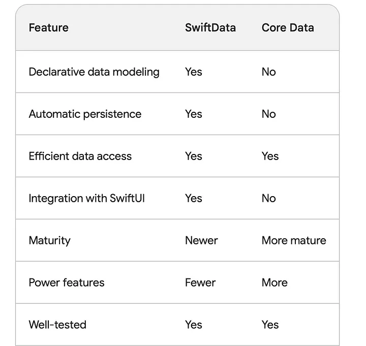

# SwiftData VS CoreData

[참고 블로그](https://medium.com/@amangupta007/swift-data-vs-core-data-2caa5d907a8d)

## SwiftData
- Declarative data modeling: 읽고 쉬운방식으로 데이터 모델을 정의할 수 있다.
- Automatic persistence: SwiftData는 데이터를 기본 스토리지에 자동으로 유지한다, 데이터를 저장하거나 로드하기 위해 코드를 작성하는것이 용이
- Efficient data access: SwiftData는 지연로딩과 같은 효율적인 데이터 액세스 방법을 사용하여 데이터에 최대한 빠르게 액세스할 수 있도록 한다.
- Integration with SwiftUI: SwiftData는 SwiftUI와 원활하게 통합하여 사용할 수 있다.

## CoreData
- Mature framework: 코어데이터는 수년 동안 사용되었기 때문에 참고할 수 있는 문서가 많다.
- Powerful features: 코어데이터는 실행 취소/다시 실행, 동시성 지원 및 iCloud와의 통합을 포함한 광범위한 기능을 제공한다.
- Well-tested: 코어데이터는 나온지 얼마 안 된 SwiftData 보다 신뢰할 수 있다.

사용하기 쉽고 효율적인 프레임워크를 찾고 있다면 SwiftData가 좋은 선택이다.  
다양한 기능을 제공하고 안전한 프레임워크를 찾고 있다면 코어데이터가 좋은 선택이다.

## 느낀점
코어데이터에서만 사용할 수 있는 기능이 필요 없다면 SwiftData를 사용하는 것이 더 쉽고 좋아보인다.   
현재 코어데이터로 되어 있는 것도 SwiftData로 바꾸는 것을 고려해봐야겠다.