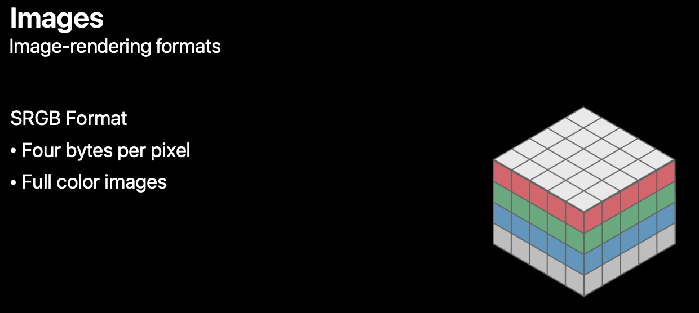
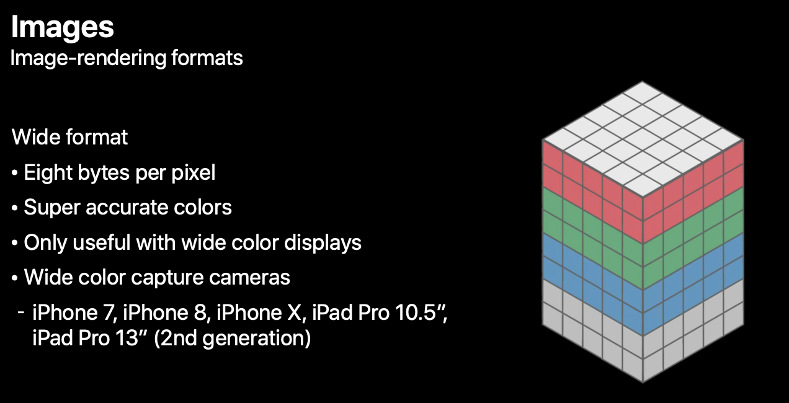

# Image Resize

## 배운점
이미지 리사이징 방법 중 UIGraphicsBeginImageContextWithOptions 과 UIGraphicsImageRenderer 방법이 있다.   

## UIGraphicsBeginImageContexth
- iOS 4.0+
- sRGB Format

## UIGraphicsImageRenderer 
- iOS 10.0+
- Wide Format

## 고민한 점

이미지를 리사이징을 해서 서버에 보내면 해당 이미지의 좌표가 리스폰스로 오는데 UIGraphicsImageRenderer로 리사이징 해서 서버에 보내면 예상하지 않은 좌표가 온다..    
포맷이 달라서 그럴것으로 예측이 되는데 더 알아봐야할 것 같다.